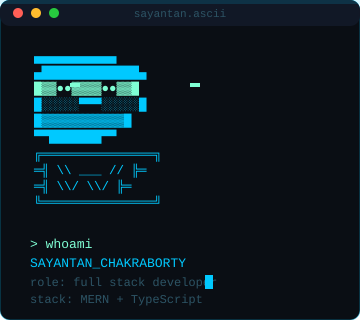

<div align="center">

<!-- ANIMATED BANNER -->


<!-- ASCII AVATAR — commented out for now, wasn't landing visually. Uncomment to bring back.

-->

<br/>

<!-- TYPING ANIMATION — shortened lines, wider canvas, nothing clipped -->


<br/>

<!-- CONTACT / SOCIAL -->
<p>
  <a href="https://github.com/SayantanCode"></a>
  <a href="https://www.npmjs.com/~sayantan_chakraborty"></a>
  <a href="mailto:sayantan648@gmail.com"></a>
  <a href="https://www.linkedin.com/in/sayantan-chakraborty-code/"></a>
</p>


</div>

<br/>

## 👨‍💻 About

```ts
const developer = {
  name: "Sayantan Chakraborty",
  stack: ["MongoDB", "Express", "React", "Node.js", "TypeScript"],
  focus: "backend-heavy, full-stack capable",
  approach: "plan the system thoroughly before touching implementation",
  worksSolo: true,
  leansOnAI: "uses AI tooling heavily to move faster and go deeper as a solo builder",
};
```

Full stack developer, backend-focused, with about 2 years of experience.
I plan systems out thoroughly before writing code, and work independently
end-to-end on my own projects — leaning on AI tooling as a force multiplier
to build and ship faster without a team behind me.

---

## 🧬 Tech Stack

<div align="center">


<br/>


</div>

<br/>

<div align="center">

| Layer | Stack |
|:--|:--|
| 🎨 **Frontend** | React · TypeScript |
| ⚙️ **Backend** | Node.js · Express · TypeScript |
| 🗄️ **Database** | MongoDB · Mongoose |
| ⚡ **Caching & Sessions** | Redis
| 📨 **Background Jobs & Queues** | BullMQ |
| 🔄 **Real-time Communication** | Socket.IO |
| 🐳 **Containerization** | Docker |
| 🚀 **Deployent** | Render · Netlify |

</div>

---

## 🛰️ Featured Project

<div align="center">

[](https://github.com/SayantanCode/express-unified-response)

<a href="https://www.npmjs.com/package/express-unified-response"></a>
<a href="https://www.npmjs.com/package/express-unified-response"></a>


A production-ready toolkit for standardized API responses, centralized
error handling, smart pagination, and adapter-based error normalization
for Express — with built-in Mongoose, Zod, JWT, Multer, and Axios support.

</div>

> This card pulls live star/fork counts straight from GitHub, so it never goes stale or shows a project that isn't actually public.

<!--
  MORE PROJECTS: tell me the exact repo names (and whether they're public)
  for any other projects you want pinned here — e.g. Vaeloop, Vayo, once
  they're pushed to GitHub — and I'll add live pin cards for each, same
  as express-unified-response above. I won't hand-write project cards
  without a real repo behind them, since that was the whole point of
  fix #4 earlier.
-->

<div align="center">

<a href="https://github.com/SayantanCode?tab=repositories"></a>

</div>

---

## 📊 Stats

<div align="center">


<br/>


<br/>


</div>

---

## 🐍 Contribution Pulse

<div align="center">

<!--START_SECTION:snake-->

<!--END_SECTION:snake-->

</div>

---

<div align="center">

If something here is useful to you, a ⭐ goes a long way.


</div>
